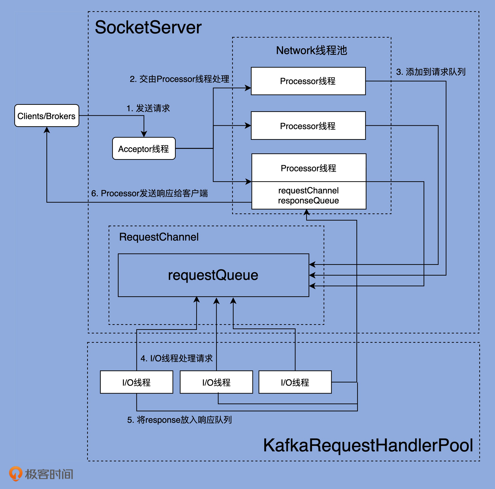

# kafka network 模块

## 概述

整个 kafka 的 network 基于主从 reactor 多线程模型设计 main reactor -> Acceptor -> subReactor -> thread pool (work threads)

但基于上述的模式下, 做出了一些的变化

1. 将中间的 subReactor 改成了 subReactor 组(Processors 网络线程组), 区分了网络IO 和本地的 IO操作
2. requestQueue(ArrayBlockingQueue) + IO 线程组 和 reactor 模式中工作线程池并没有本质区别, 工作线程池中也有一个阻塞的队列

